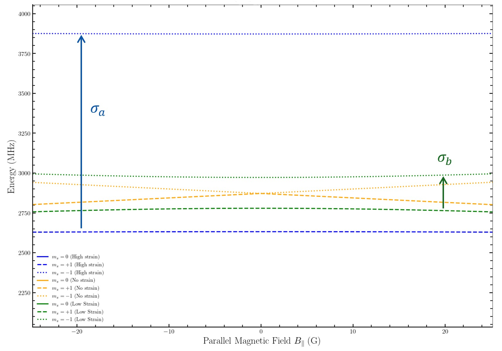
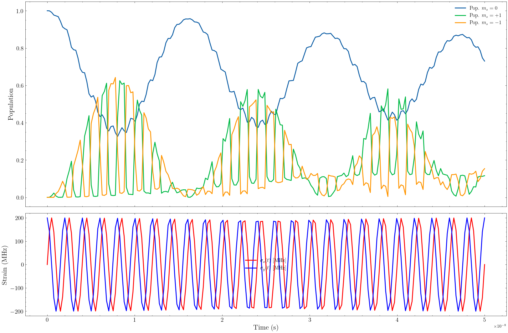
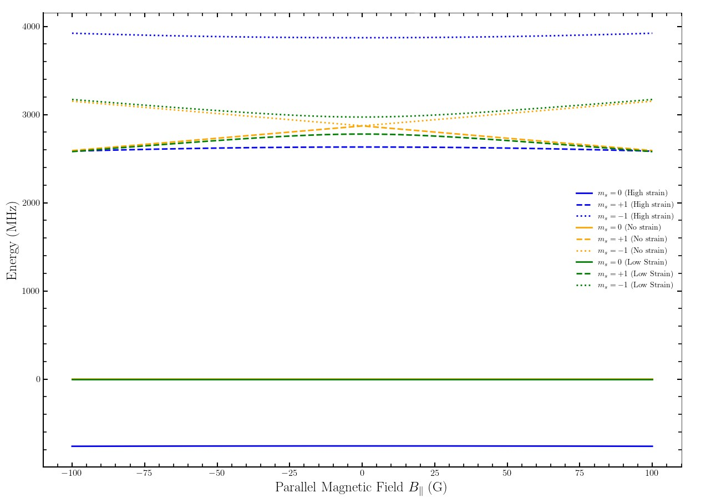

# Phonon-Driven Spin Dynamics in Nitrogen-Vacancy Centres

> Undergraduate research project investigating RF-free quantum control of nitrogen-vacancy (NV) centres through time-dependent lattice strain.


[]()
[]()

## Overview

Nitrogen-vacancy (NV) centres in diamond are among the most promising solid-state quantum systems for applications in quantum sensing, precision magnetometry and quantum information processing.

Conventional optically detected magnetic resonance (ODMR) relies on microwave excitation to manipulate spin states. This project investigates an alternative approach by numerically modelling whether **time-dependent lattice strain (phonons)** can coherently drive spin transitions without requiring radio-frequency fields.

To investigate this, a complete spin-1 Hamiltonian was implemented in Python and extended to include magnetic, hyperfine and strain interactions. Numerical simulations were then performed to analyse energy level evolution, anti-crossings and coherent population dynamics under oscillating strain fields.

This repository contains the complete simulation framework together with the accompanying dissertation, Hamiltonian derivation, research poster and generated figures.

---

## Research Motivation

Nitrogen-vacancy (NV) centres are one of the most promising solid-state quantum systems for precision sensing due to their long coherence times and optical readout capabilities.

Traditional optically detected magnetic resonance (ODMR) relies on microwave excitation. This project investigates whether **time-dependent lattice strain (phonons)** can provide an alternative mechanism for driving spin transitions.

The simulation models the quantum dynamics of the NV centre under magnetic fields, hyperfine interactions and oscillating strain fields.

---

## Key Results
The numerical simulations demonstrated that oscillating strain modifies the NV centre energy spectrum and induces coherent population dynamics between spin states.

Key outputs include:

- Magnetic-field-dependent energy level diagrams
- Time-varying strain simulations
- Anti-crossing detection algorithms
- Quantum state population evolution
- Visualisation of strain-induced spin dynamics

These results provide a computational framework for investigating phonon-assisted quantum control in NV centres and establish a foundation for future experimental validation.

---

## Simulation Capabilities

The simulation framework includes:

- Construction of the complete spin-1 NV centre Hamiltonian
- Zero-field splitting and Zeeman interactions
- Hyperfine coupling terms
- Static and time-dependent strain perturbations
- Numerical Hamiltonian diagonalisation
- Energy level evolution as a function of magnetic field
- Automatic anti-crossing identification
- Time-dependent Schrödinger equation solver
- Population dynamics simulations
- Publication-quality scientific visualisations

---
## Quick Start

### Clone the repository

```bash
git clone https://github.com/Luke-Simunic/nv-center-simulation.git
```

### Install dependencies

```bash
pip install -r requirements.txt
```

### Run the simulation

```bash
python src/simulation.py

```

## Repository Structure

```text
src/
    simulation.py

plots/
    energy_levels.jpg
    ...
    population_dynanics_under_resonant_conditions.png

report/
    NV_Center_Research_Report.pdf
    Hamiltonian_Derivation.tex
    Faculty_Research_Poster.pdf
```

---

## Example Results

### Energy Level Splitting



---

### Time-Varying Strain Simulation



---

### Anti-Crossing Behaviour



---

## Methodology

The numerical framework was developed entirely in Python.

Major components include

- Hamiltonian construction using matrix mechanics
- Eigenvalue decomposition of the spin Hamiltonian
- Numerical integration of the time-dependent Schrödinger equation using SciPy
- Dynamic strain modelling
- Population analysis
- Scientific data visualisation

---

## Technologies

- Python
- NumPy
- SciPy
- Matplotlib
- LaTeX
- Quantum Mechanics
- Scientific Computing
- Numerical Modelling

---

## Research Outputs

This repository includes

- Undergraduate research
- Complete simulation code
- Hamiltonian derivation
- Faculty research poster
- Generated simulation figures

---

## Future Work

Potential extensions include

- Introducing the rotating wave approximation to remove noise
- Full Lindblad master equation simulations
- Decoherence modelling
- Optical pumping dynamics
- Microwave-free ODMR optimisation
- Experimental validation against published NV centre measurements

---

## Author

**Luke Simunic**

Bachelor of Science (Physics)

RMIT University

Interests:

- Quantum sensing
- Scientific computing
- Numerical simulation
- Data analysis
- Quantum technologies
